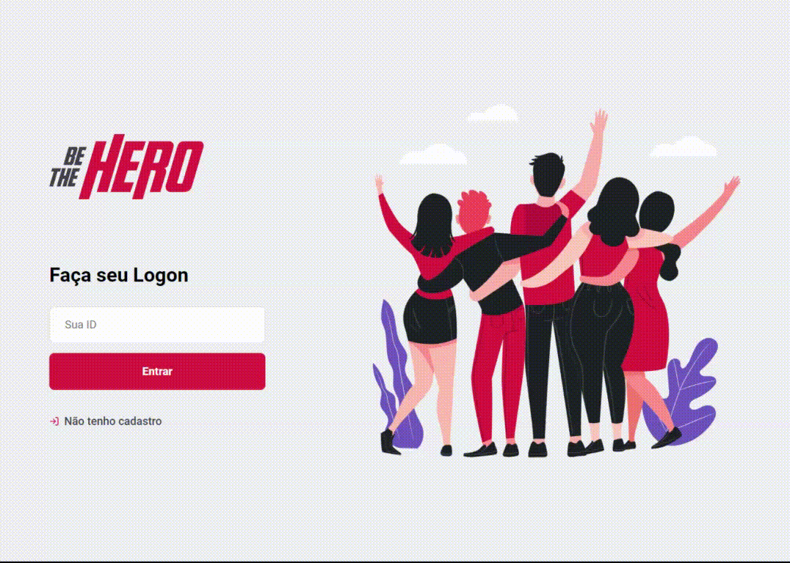

<h1 align="center">
    
</h1>

<h2 align="center">

  
   
  🚀 Semana Omnistack 11 - Be The Hero
</h2>

  <a href="#two_hearts-o-projeto">O Projeto</a>&nbsp;&nbsp;&nbsp;|&nbsp;&nbsp;&nbsp;
  <a href="#rocket-tecnologias">Tecnologias</a>&nbsp;&nbsp;&nbsp;|&nbsp;&nbsp;&nbsp;
  <a href="#computer-layout">Layout</a>&nbsp;&nbsp;&nbsp;|&nbsp;&nbsp;&nbsp;

 

# :two_hearts: O Projeto

O **Be The Hero** existe para conectar pessoas interessadas em ajudar ONGs  à ONGs que precisem arrecadar dinheiro para uma ação.

# :rocket: Tecnologias

O Be The Hero foi desenvolvido com as seguintes tecnologias:

- Backend → [Node.js](https://nodejs.org/en/)
- Frontend Web → [React](https://reactjs.org)
- Frontend Mobile → [React Native](https://facebook.github.io/react-native/)

Extras:

- Main Libs
  - [Express](https://expressjs.com/pt-br/)
  - [KnexJS - Query Builder](http://knexjs.org/)
  - [Expo](https://expo.io/)
  - [Toast Notification](https://github.com/jossmac/react-toast-notifications)

# :computer: Layout

## Aplicação Web com React

---

Feito com ❤️ por **Rocketseat / Patryck Gratão**